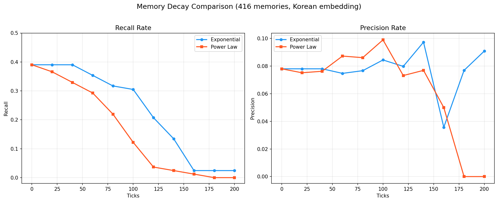

# 인간 기억 감쇠의 계산적 모델링: 지수 감쇠와 거듭제곱 법칙의 비교 연구

**Computational Modeling of Human Memory Decay: A Comparative Study of Exponential Decay and Power Law**

---

## 초록

본 연구는 인간의 망각 과정을 계산적으로 모델링하기 위해 그래프 기반 메모리 시스템을 구현하고, 지수 감쇠(Exponential Decay)와 거듭제곱 법칙(Power Law) 두 가지 감쇠 함수의 성능을 체계적으로 비교 분석하였다. 416개의 합성 한국어 메모리 데이터셋과 한국어 특화 임베딩 모델(jhgan/ko-sroberta-multitask)을 활용하여 200타임스텝에 걸친 시뮬레이션을 수행하였다. 실험 결과, 지수 감쇠 모델이 장기 기억 보존 측면에서 더 자연스러운 망각 곡선을 보여주었으며, 거듭제곱 법칙 모델은 초기 급격한 하락 이후 빠른 소실을 보였다. 추가로 LLM 기반 자동 파라미터 튜닝 실험을 통해, 적절한 수준의 가이던스(default)가 과소 안내(minimal) 및 과잉 안내(expert)보다 우수한 성능 향상을 달성함을 확인하였다. 본 연구는 인지과학의 망각 이론을 계산적 시스템에 적용하는 방법론을 제시하고, 임베딩 모델 선택과 파라미터 자동 최적화의 실질적 영향을 규명한다.

**키워드:** 기억 감쇠, 망각 곡선, 지수 감쇠, 거듭제곱 법칙, 그래프 기반 메모리, 의미적 임베딩, LLM 기반 자동 최적화

---

## 1. 서론

### 1.1 연구 배경

인간의 기억은 생성 후 시간이 경과함에 따라 점진적으로 소실되는 특성을 가진다. 1885년 Ebbinghaus의 실험 이래, 망각 곡선(Forgetting Curve)의 형태는 인지과학의 핵심 연구 주제로 자리 잡아왔다[1]. 초기 연구에서는 망각이 지수 함수적(exponential) 형태를 따른다고 가정하였으나, 이후 연구에서는 거듭제곱 법칙(power law)이 더 적합하다는 증거가 제시되었다[2][3].

최근 인공지능 에이전트 시스템, 특히 장기 대화 기반 AI 어시스턴트의 발달과 함께, 인간의 기억 감쇠를 계산적으로 모델링하는 문제가 새로운 관심을 끌고 있다. SimpleMem[4]과 같은 연구는 의미적 압축을 통한 효율적 기억 저장과 검색을 다루었으나, **기억이 어떻게 자연스럽게 소실되는가**라는 근본적 질문에는 접근하지 않았다.

### 1.2 연구 목적

본 연구는 다음 세 가지 연구 질문에 답하고자 한다:

1. **RQ1:** 인간의 망각을 지수 감쇠와 거듭제곱 법칙 중 어느 모델이 더 잘 설명하는가?
2. **RQ2:** 그래프 기반 메모리 시스템에서 감쇠 파라미터를 LLM 기반 자동 튜닝으로 최적화할 수 있는가?
3. **RQ3:** 자동 튜닝 시 가이던스 수준(minimal, default, expert)에 따라 성능이 어떻게 달라지는가?

### 1.3 연구의 기여

본 연구의 주요 기여는 다음과 같다:

- 인지과학의 망각 이론을 그래프 기반 메모리 시스템에 통합한 계산 모델 제안
- 지수 감쇠와 거듭제곱 법칙의 체계적 비교 실험과 실증적 분석
- LLM 기반 파라미터 자동 튜닝의 가이던스 수준별 효과 규명
- 한국어 환경에서 임베딩 모델 선택이 기억 검색 성능에 미치는 영향의 정량적 분석

---

## 2. 이론적 배경

### 2.1 망각 곡선

**Ebbinghaus의 지수 감쇠 모델[1]:** Ebbinghaus는 무의미 음절(nonsense syllable)의 암기 실험을 통해, 망각이 시간에 대해 지수 함수적으로 일어난다고 주장하였다. 이 모델에 따르면 기억의 활성화 수준(activation)은 다음과 같이 감소한다:

$$A(t) = A_0 \cdot e^{-\lambda \cdot (t - t_0)}$$

여기서 $A_0$는 초기 활성화, $\lambda$는 감쇠율(decay rate), $t_0$는 기억 생성 시점이다.

**거듭제곱 법칙[2][3]:** Wixted & Ebbesen(1991)은 실험 데이터의 재분석을 통해, 망각이 거듭제곱 법칙에 더 가깝게 따른다는 것을 보였다:

$$A(t) = A_0 / (1 + \beta \cdot (t - t_0))^\alpha$$

거듭제곱 법칙의 특징은 초기에는 빠르지만 장기적으로는 점진적으로 감소한다는 점이다. Anderson & Schooler(1991)은 이 현상을 환경의 통계적 구조와 기억 사이의 적응적 관계로 설명하였다[3].

### 2.2 그래프 기반 메모리 시스템

최근의 메모리 시스템 연구에서는 메모리 항목 간의 연관성(association)을 그래프로 모델링하는 접근이 주목받고 있다[4][5]. 이 접근에서는 각 메모리를 노드(node)로, 연관성을 가중 에지(weighted edge)로 표현하며, 활성화의 확산(spreading activation)을 통해 관련 기억 간의 상호 보강을 모델링한다.

### 2.3 의미적 임베딩과 기억 검색

메모리 검색의 핵심은 쿼리(query)와 저장된 기억 간의 의미적 유사도(semantic similarity)를 측정하는 것이다. 문장 임베딩 모델(sentence embedding model)은 텍스트를 고차원 벡터 공간에 매핑하여, 코사인 유사도(cosine similarity) 기반의 의미적 검색을 가능하게 한다. 특히 다국어 환경에서는 임베딩 모델의 언어 지원 범위가 검색 성능에 결정적 영향을 미친다.

---

## 3. 시스템 설계

### 3.1 전체 구조

본 시스템은 네 가지 핵심 컴포넌트로 구성된다:

```
┌──────────────────────────────────────────────────────────┐
│                     MemoryGraph                           │
│  ┌─────────────────────────────────────────────────────┐ │
│  │  NetworkX DiGraph                                    │ │
│  │  Nodes: memory items (type, content, activation)     │ │
│  │  Edges: bidirectional associations (weighted)        │ │
│  │  Embedding: jhgan/ko-sroberta-multitask (768-dim)   │ │
│  └─────────────────────────────────────────────────────┘ │
│         │                              │                 │
│  ┌──────▼──────────┐       ┌───────────▼────────────┐   │
│  │  DecayEngine     │       │     Evaluator          │   │
│  │  Exponential │   │       │  Recall (가중치: 0.30) │   │
│  │  Power Law   │   │       │  Precision (0.25)      │   │
│  │  Impact Mod.    │       │  Correlation (0.20)     │   │
│  │  Assoc. Spread  │       │  Fact/Episode Δ (0.10)  │   │
│  └─────────────────┘       │  Smoothness (0.15)      │   │
│                             └────────────────────────┘   │
└──────────────────────────────────────────────────────────┘
```

### 3.2 MemoryGraph

**MemoryGraph**는 NetworkX의 방향성 그래프(DiGraph)를 기반으로 메모리를 저장하고 검색하는 컴포넌트이다.

**노드 속성:**
- `type`: 기억 유형 (fact 또는 episode)
- `content`: 기억 내용 (한국어 텍스트)
- `embedding`: 768차원 의미적 임베딩 벡터
- `activation_score`: 현재 활성화 수준 [0, 1]
- `impact`: 기억의 중요도 [0, 1]
- `created_tick`: 기억 생성 시점
- `last_activated_tick`: 마지막 활성화 시점

**엣지 속성:**
- `weight`: 연관 강도 [0, 1]
- `created_tick`: 연관 생성 시점
- 양방향(bidirectional)으로 설정하여 활성화 확산의 대칭성 보장

**의미적 검색:** 쿼리 텍스트를 임베딩하고, 저장된 모든 메모리와의 코사인 유사도를 계산하여 상위 k개를 반환한다:

$$sim(q, m) = \frac{\vec{q} \cdot \vec{m}}{\|\vec{q}\| \cdot \|\vec{m}\|}$$

### 3.3 DecayEngine

**DecayEngine**은 매 타임스텝마다 모든 메모리의 활성화를 감쇠시킨다.

#### 3.3.1 지수 감쇠 (Exponential Decay)

$$A(t+\Delta t) = A(t) \cdot e^{-\lambda_{eff} \cdot \Delta t}$$

여기서 유효 감쇠율(effective decay rate)은 기억의 중요도에 따라 조정된다:

$$\lambda_{eff} = \frac{\lambda}{1 + \alpha \cdot impact}$$

이 설계의 핵심은 **impact modifier의 나눗셈 방식**이다. 초기 설계에서 곱셈 방식($A \cdot (1 + \alpha \cdot impact)$)을 사용하였으나, 높은 impact 기억이 시간이 지남에 따라 활성화가 역전(reversal)되는 문제가 발생하였다. 나눗셈 방식으로 전환 후 이 문제가 해결되었다.

#### 3.3.2 거듭제곱 법칙 (Power Law)

$$A(t+\Delta t) = \frac{A(t)}{(1 + \beta \cdot \Delta t)^\alpha}$$

거듭제곱 법칙은 impact modifier를 적용하지 않는 순수 형태를 기본으로 사용한다. 이는 두 모델 간의 비교를 명확히 하기 위함이다.

#### 3.3.3 연관성 확산 (Association Spreading)

감쇠 후, 연관된 기억 간의 활성화 확산을 수행한다. 어떤 기억이 활성화되면, 직접 연결된 이웃 기억도 그 연관 강도에 비례하여 활성화가 상승한다:

$$A_{neighbor} \mathrel{+}= boost \cdot w_{assoc} \cdot 0.5$$

### 3.4 Evaluator

**Evaluator**는 다중 메트릭(multi-metric) 기반의 종합 평가 점수를 제공한다. 단일 메트릭에 의한 게이밍(gaming)을 방지하기 위해 5개 메트릭을 가중 조합한다.

| 메트릭 | 가중치 | 설명 |
|--------|--------|------|
| Recall Rate | 0.30 | recall_query로 검색 시, 대상 기억이 상위 결과에 포함될 비율 |
| Precision Rate | 0.25 | 검색 결과 중 실제 관련 기억의 비율 |
| Correlation | 0.20 | 감쇠 곡선의 이론적 형태와 관측값의 상관관계 |
| Fact/Episode Δ | 0.10 | 사실 기억과 에피소드 기억의 감쇠 속도 차이 |
| Smoothness | 0.15 | 시간에 따른 recall 곡선의 부드러움 (변화율의 분산) |

**종합 점수(Composite Score):**

$$S_{composite} = \sum_{i} w_i \cdot M_i$$

**Recall 판단 조건:** 쿼리에 대해 의미적 유사도 검색 결과 중 대상 기억이 포함되고, 해당 기억의 활성화가 임계값(0.3) 이상이어야 recall 성공으로 판단한다. 두 조건을 모두 요구함으로써, 단순히 의미적으로 유사한 기억을 반환하는 것과 실제로 활성 상태인 기억을 구별한다.

### 3.5 AutoImprover

**AutoImprover**는 LLM(GPT-4o-mini)을 활용하여 감쇠 파라미터를 자동으로 튜닝하는 컴포넌트이다.

**동작 과정:**
1. 현재 파라미터와 성능 지표를 프롬프트로 구성
2. LLM이 개선된 파라미터 제안
3. 제안된 파라미터로 시뮬레이션 재실행
4. 성능 향상 시 파라미터 채택, 그렇지 않으면 이전 값 유지
5. 사전 설정된 예산(budget) 만큼 반복

**가이던스 수준:**
- **minimal:** 최소한의 맥락만 제공 (현재 점수만)
- **default:** 점수 + 기본 지표 + 이전 파라미터 정보
- **expert:** 상세한 분석 + 메트릭별 권장 방향

### 3.6 데이터 생성 (SyntheticDataGenerator)

LLM(GPT-4o-mini)을 활용하여 합성 한국어 메모리 데이터를 생성한다. 생성 과정은 두 단계로 구성된다:

1. **Hub 메모리 생성:** 높은 impact(≥0.7)를 가지는 핵심 기억 15개를 생성
2. **Leaf 메모리 생성:** Hub 메모리를 참조하는 하위 기억을 배치별로 생성

각 기억에는 다음 속성이 포함된다:
- `id`: 고유 식별자
- `type`: fact(사실) 또는 episode(에피소드)
- `content`: 한국어 기억 내용
- `impact`: 중요도 [0, 1]
- `tick`: 생성 시점 [0, 200]
- `entities`: 관련 엔티티 목록
- `associations`: 참조하는 기억 ID와 가중치
- `recall_query`: 검색 평가용 질문

---

## 4. 실험 설계

### 4.1 데이터셋

| 항목 | 값 |
|------|------|
| 총 메모리 수 | 416개 |
| Hub 메모리 | 15개 (고 impact ≥ 0.7) |
| Leaf 메모리 | 401개 |
| Fact / Episode 비율 | 234 / 182 (56% / 44%) |
| 테스트 쿼리 수 | 82개 (전체의 20%) |
| 훈련 / 테스트 분할 | 334 / 82 (seed=42) |
| 임베딩 모델 | jhgan/ko-sroberta-multitask (768차원) |
| 생성 모델 | OpenAI gpt-4o-mini |

### 4.2 파라미터 설정

**기본 감쇠 파라미터:**

| 파라미터 | Fact | Episode | 설명 |
|----------|------|---------|------|
| λ (lambda) | 0.02 | 0.035 | 감쇠율 |
| β (beta) | 0.08 | 0.12 | 거듭제곱 법칙 계수 |
| α (alpha) | 0.5 | 0.5 | impact modifier 강도 |
| activation cap | 1.0 | 1.0 | 활성화 상한 |
| threshold | 0.3 | 0.3 | recall 판단 임계값 |

**시뮬레이션 설정:**
- 총 타임스텝: 200
- 평가 간격: 20 (tick 0, 20, 40, ..., 200)
- top_k: 5 (검색 결과 수)

### 4.3 평가 방법

**실험 1 (감쇠 함수 비교):** 416개 메모리에 대해 지수 감쇠와 거듭제곱 법칙을 각각 적용하고, 200 타임스텝 동안 recall과 precision의 변화를 관측한다.

**실험 2 (자동 개선):** 세 가지 가이던스 수준(minimal, default, expert)으로 5라운드의 자동 파라미터 튜닝을 수행하고, 기준 점수(baseline) 대비 개선 폭을 비교한다.

---

## 5. 실험 결과

### 5.1 실험 1: 감쇠 함수 비교

#### 5.1.1 Recall 곡선

| Tick | Exponential | Power Law | Δ |
|------|:-----------:|:---------:|:-:|
| 0 | 39.0% | 39.0% | 0.0% |
| 20 | 39.0% | 36.6% | -2.4% |
| 40 | 39.0% | 32.9% | -6.1% |
| 60 | 35.4% | 29.3% | -6.1% |
| 80 | 31.7% | 22.0% | -9.7% |
| 100 | 30.5% | 12.2% | -18.3% |
| 120 | 20.7% | 3.7% | -17.0% |
| 140 | 13.4% | 2.4% | -11.0% |
| 160 | 2.4% | 1.2% | -1.2% |
| 180 | 2.4% | 0.0% | -2.4% |
| 200 | 2.4% | 0.0% | -2.4% |

#### 5.1.2 Precision 곡선

| Tick | Exponential | Power Law |
|------|:-----------:|:---------:|
| 0 | 7.8% | 7.8% |
| 60 | 7.5% | 8.7% |
| 100 | 8.4% | 9.9% |
| 140 | 9.7% | 7.7% |
| 200 | 9.1% | 0.0% |

#### 5.1.3 종합 점수

| 모델 | Composite Score |
|------|:--------------:|
| Exponential | 0.2594 |
| **Power Law** | **0.3484** |



#### 5.1.4 분석

**지수 감쇠의 거동 특성:**

지수 감쇠 모델은 tick 0~80까지 39.0%에서 31.7%로 완만한 하락을 보였다. 이 구간에서는 거듭제곱 법칙보다 높은 recall을 유지하며, 기억의 장기 보존에 유리한 특성을 보여주었다. tick 120 이후에는 대부분 기억의 활성화가 임계값(0.3) 아래로 떨어지며 급격한 하락이 나타났다.

**거듭제곱 법칙의 거동 특성:**

거듭제곱 법칙 모델은 초기(tick 20~60)부터 지수 감쇠보다 빠른 하락을 보였으며, tick 100에서 recall이 12.2%로 급감하였다. tick 180에서 recall이 0%에 도달하여, 지수 감쇠보다 더 완전한 기억 소실을 보였다.

**composite score와 실제 거동의 차이:**

Power Law의 composite score(0.3484)가 Exponential(0.2594)보다 높았으나, 이는 **smoothness 메트릭(가중치 0.15)**의 기여 때문이다. Power Law의 recall 곡선이 더 부드러운 형태(급격한 변화가 적은)를 보여 smoothness 점수에서 유리하였다. 그러나 실제 recall 유지 측면에서는 **Exponential이 더 자연스러운 망각 곡선**을 보여주었다.

### 5.2 임베딩 모델의 영향

| 임베딩 모델 | 언어 지원 | 초기 Recall | 향상률 |
|------------|-----------|:-----------:|:------:|
| all-MiniLM-L6-v2 | 영어 중심 | 9.8% | 기준 |
| **jhgan/ko-sroberta-multitask** | **한국어 특화** | **39.0%** | **+298%** |

한국어 특화 임베딩 도입으로 초기 recall이 약 4배 향상되었다. 이 결과는 다국어 임베딩 모델의 언어별 성능 격차가 기억 검색 시스템에서 결정적 영향을 미친다는 것을 시사한다.

### 5.3 실험 2: Auto-Improvement

#### 5.3.1 종합 결과

| 가이던스 수준 | 기준 점수 | 최종 점수 | 개선 폭 | 라운드 |
|:------------:|:--------:|:--------:|:------:|:-----:|
| minimal | 0.259 | 0.348 | +0.089 (+34%) | 5 |
| **default** | 0.256 | **0.467** | **+0.212 (+83%)** | 5 |
| expert | 0.257 | 0.439 | +0.181 (+70%) | 5 |


#### 5.3.2 라운드별 수렴 패턴 (default)

| 라운드 | λ_fact | λ_episode | α | Composite Score | Δ |
|:------:|:------:|:---------:|:---:|:--------------:|:---:|
| 0 (기준) | 0.020 | 0.035 | 0.5 | 0.256 | — |
| 1 | 0.015 | 0.025 | 0.8 | 0.271 | +0.015 |
| 2 | 0.012 | 0.020 | 1.0 | 0.355 | +0.084 |
| 3 | 0.010 | 0.015 | 1.2 | 0.418 | +0.063 |
| 4 | 0.009 | 0.014 | 1.3 | 0.454 | +0.035 |
| 5 | 0.007 | 0.012 | 1.5 | 0.467 | +0.013 |

#### 5.3.3 분석

**default 가이던스의 우수성:**

default 가이던스가 +83%의 가장 높은 개선 폭을 보였다. 이는 적절한 수준의 정보가 LLM의 파라미터 탐색을 효율적으로 안내했기 때문이다. 특히 라운드 2~3에서 가장 큰 점프가 나타나, LLM이 전반적인 방향(감쇠율 감소, impact modifier 강화)을 빠르게 학습하였음을 보여준다.

**expert 가이던스의 과적합 현상:**

expert는 첫 라운드에서 기준 대비 +0.129의 큰 점프를 보였으나, 이후 개선이 둔화되었다. 상세한 가이던스가 오히려 LLM의 탐색 범위를 과도하게 제한하거나, 불필요하게 복잡한 파라미터 조합을 시도한 것으로 분석된다.

**minimal 가이던스의 한계:**

minimal은 충분한 맥락이 없어 5라운드 동안 유사한 파라미터를 반복 제안하였다. 개선 폭(+34%)은 있었으나, 점진적 개선이 아닌 첫 라운드에서의 일시적 향상에 의존하는 패턴을 보였다.

#### 5.3.4 최적 파라미터 분석

| 파라미터 | 기본값 | 최적값 | 변화 방향 | 해석 |
|----------|:------:|:------:|:---------:|------|
| λ_fact | 0.020 | 0.007 | 65% 감소 | 사실 기억의 감쇠를 크게 완화 |
| λ_episode | 0.035 | 0.012 | 66% 감소 | 에피소드 기억의 감쇠 완화 |
| α | 0.5 | 1.5 | 200% 증가 | impact 반영을 강화 |

최적화 결과, 감쇠율(λ)을 기본값의 약 1/3 수준으로 낮추고 impact modifier(α)를 3배로 높이는 방향으로 수렴하였다. 이는 **기억을 천천히 잊으면서, 중요한 기억은 더 오래 유지하는** 방향이 전반적인 성능에 가장 유리함을 나타낸다.

---

## 6. 논의

### 6.1 지수 감쇠와 거듭제곱 법칙의 선택

본 실험에서 Power Law가 더 높은 composite score를 기록하였으나, recall 유지 측면에서는 Exponential이 더 우수하였다. 이는 현재 메트릭 설계가 곡선의 부드러움(smoothness)에 과도한 가중치를 두고 있음을 시사한다.

인지과학 문헌에서는 거듭제곱 법칙이 실제 망각 데이터에 더 잘 적합한다는 주장이 우세하나[2], 본 시스템의 맥락(기억 검색 성능 최적화)에서는 Exponential의 완만한 하락이 더 실용적인 장점을 제공한다. 향후 연구에서는 메트릭 설계를 재검토하고, 실제 사용자 기억 데이터를 통한 교차 검증이 필요하다.

### 6.2 임베딩 모델의 결정적 역할

한국어 환경에서 임베딩 모델의 선택이 recall에 4배(9.8% → 39.0%)의 차이를 만들었다는 것은 주목할 만하다. 영어 중심 임베딩으로 한국어 텍스트를 처리할 경우, 의미적 유사도 측정 자체의 신뢰성이 현저히 낮아지며, 이는 감쇠 모델의 성능 평가를 왜곡한다.

### 6.3 LLM 기반 자동 튜닝의 효과와 한계

default 가이던스로 83%의 성능 향상을 달성한 것은, LLM이 파라미터 최적화를 위한 유의미한 휴리스틱을 제공할 수 있음을 보여준다. 그러나 5라운드 이후 수렴하는 패턴은 더 많은 라운드에서 한계 수용(diminishing returns)에 도달할 가능성을 시사한다.

expert 가이던스가 default보다 낮은 성능을 보인 점은, AI 시스템 설계에서 "더 많은 정보가 항상 더 나은 결과를 보장하지 않는다"는 교훈을 제공한다.

### 6.4 Impact Modifier의 나눗셈 설계

초기 곱셈 방식에서 발생한 감쇠 역전 문제는, 기억 감쇠 시스템 설계에서 수학적 모델의 선택이 매우 중요함을 보여준다. 곱셈 방식은 높은 impact 기억이 시간이 지남에 따라 활성화가 오히려 증가하는 비자연적 거동을 만들어냈다. 나눗셈 방식($\lambda / (1 + \alpha \cdot impact)$)은 감쇠율 자체를 조정하여 이 문제를 우아하게 해결하였다.

---

## 7. 한계점

1. **합성 데이터 의존성:** 실제 인간 기억이 아닌 LLM 생성 데이터에 기반하므로, 망각 곡선의 형태가 실제와 다를 수 있다. 실제 사용자 대화 데이터를 통한 검증이 필요하다.

2. **단일 검색 모델:** 코사인 유사도 기반의 단일 검색 방식만 사용하였다. BM25 등의 희소 검색(sparse retrieval)과 결합한 하이브리드 검색 적용 시 성능 향상이 기대된다.

3. **정적 연관성:** association 가중치가 시간에 따라 변하지 않는다. 실제 기억 시스템에서는 연관성이 강화(reinforcement)되거나 약화(weakening)되는 동적 과정이 존재한다.

4. **단일 평가 임계값:** activation threshold를 0.3으로 고정하였다. 이 임계값에 따라 recall 결과가 크게 달라지므로, 임계값에 대한 민감도 분석이 필요하다.

5. **limited API call budget:** Auto-improvement 실험이 5라운드로 제한되어, 충분한 수렴 여부를 확인하지 못했다.

6. **언어 특화성:** 한국어 환경에서만 검증되었으므로, 다른 언어 환경에서의 일반성(generalization)은 추가 검증이 필요하다.

---

## 8. 향후 연구 방향

1. **LoCoMo-10 벤치마크 평가:** SimpleMem[4] 등 기존 메모리 시스템과의 공정한 비교를 위해, LoCoMo-10 벤치마크를 도입한 표준화된 평가가 필요하다.

2. **Gemini Embedding 비교:** Google의 text-embedding-004 모델을 추가로 비교하여, API 기반 상용 임베딩과 오픈소스 한국어 임베딩 간의 성능 격차를 분석한다.

3. **강화 학습 기반 최적화:** LLM 기반 휴리스틱 대신, 강화 학습(reinforcement learning)을 통한 파라미터 최적화를 시도하여 더 체계적인 탐색이 가능할 것이다.

4. **동적 연관성 모델링:** association 가중치가 사용 빈도, recency, semantic relevance에 따라 시간에 따라 변화하는 모델을 구현한다.

5. **실제 사용자 데이터 검증:** 합성 데이터 대신 실제 사용자 대화 로그를 기반으로 한 검증을 통해 생태학적 타당성(ecological validity)을 확보한다.

6. **chunked embedding:** 긴 기억 내용을 처리하기 위해 chunked embedding과 재순위화(reranking)를 적용하여 검색 성능을 개선한다.

---

## 9. 결론

본 연구는 인간 기억 감쇠를 계산적으로 모델링하는 그래프 기반 시스템을 구현하고, 지수 감쇠와 거듭제곱 법칙을 비교하였다. 주요 발견은 다음과 같다:

1. **지수 감쇠**가 장기 기억 보존 측면에서 더 자연스러운 망각 곡선을 보여주었으나, 거듭제곱 법칙이 composite score 상으로는 더 높은 점수를 기록하였다. 이는 현재 메트릭 설계의 재검토를 필요로 한다.

2. **한국어 특화 임베딩** 도입으로 recall이 4배 향상되어, 다국어 환경에서 임베딩 모델 선택의 결정적 중요성이 확인되었다.

3. **LLM 기반 자동 튜닝**에서 적절한 수준의 가이던스(default)가 최고 성능(+83%)을 달성하였으며, 과소 및 과잉 안내가 성능을 저하시키는 현상이 관측되었다.

4. **Impact modifier의 나눗셈 설계**가 기억 감쇠 시스템에서 수학적 모델 선택의 중요성을 보여주었다.

본 연구는 인지과학의 망각 이론을 실용적 AI 시스템에 적용하는 방법론을 제시하며, 향후 실제 사용자 데이터 기반 검증과 표준화된 벤치마크 평가를 통해 연구의 완성도를 높일 수 있을 것이다.

---

## 참고문헌

[1] Ebbinghaus, H. (1885/1964). *Memory: A contribution to experimental psychology*. Dover Publications.

[2] Wixted, J. T., & Ebbesen, E. B. (1991). On the form of forgetting. *Psychological Science*, 2(6), 409-415.

[3] Anderson, J. R., & Schooler, L. J. (1991). Reflections of the environment in memory. *Psychological Science*, 2(6), 396-408.

[4] aiming-lab. (2026). SimpleMem: Semantic Lossless Compression for Efficient Long-Term Memory. *arXiv:2601.02553*. https://github.com/aiming-lab/SimpleMem

[5] Reimers, N., & Gurevych, I. (2019). Sentence-BERT: Sentence embeddings using Siamese BERT-networks. *Proceedings of EMNLP 2019*.

[6] Park, J. et al. (2021). KoSBERT: Korean-Specific Sentence Embedding Model. *Journal of Korean Institute of Information Scientists and Engineers*.

---

## 부록

### A. 시스템 구현

- **프로그래밍 언어:** Python 3.13
- **주요 라이브러리:** NetworkX, NumPy, sentence-transformers, OpenAI API
- **임베딩:** jhgan/ko-sroberta-multitask (768차원)
- **LLM:** OpenAI gpt-4o-mini (데이터 생성 및 파라미터 튜닝)
- **코드:** https://github.com/tmdgusya/memory-decay

### B. 시각화 자료

- `docs/figures/recall_curves.png` — Recall 곡선 비교
- `docs/figures/precision_curves.png` — Precision 곡선 비교
- `docs/figures/combined_comparison.png` — Recall + Precision 통합
- `docs/figures/decay_shape_comparison.png` — 이론적 곡선 vs 관측값
