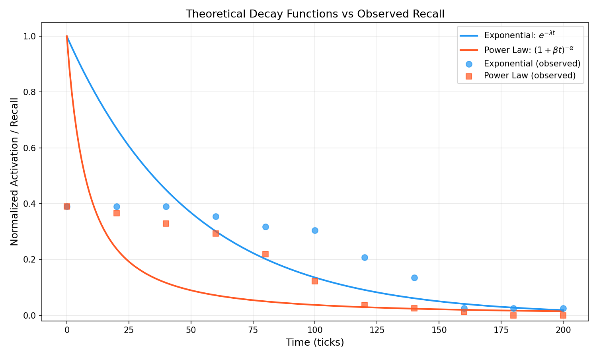

# Computational Modeling of Human Memory Decay

## 최종 연구 리포트

**프로젝트:** memory-decay  
**작성일:** 2026-03-18  
**리포지토리:** [tmdgusya/memory-decay](https://github.com/tmdgusya/memory-decay)

---

## 1. 연구 개요

인간의 망각 과정을 계산적으로 모델링하는 시스템을 구현하고, 지수 감쇠(Exponential Decay)와 거듭제곱 법칙(Power Law) 두 가지 감쇠 함수의 성능을 비교 분석했다.

### 연구 질문
1. 인간의 망각을 지수 감쇠와 거듭제곱 법칙 중 어느 모델이 더 잘 설명하는가?
2. 그래프 기반 메모리 시스템에서 감쇠 파라미터를 자동 최적화할 수 있는가?
3. 가이던스 수준에 따른 자동 개선 효과는 어떠한가?

---

## 2. 시스템 아키텍처

```
┌─────────────────────────────────────────────────────┐
│                    MemoryGraph                       │
│  (NetworkX DiGraph + Embedding Similarity)           │
│  - Nodes: memory items (type, content, activation)   │
│  - Edges: associations (weighted, bidirectional)     │
│  - Embedding: jhgan/ko-sroberta-multitask (768-dim)  │
└──────────────┬──────────────────────┬───────────────┘
               │                      │
     ┌─────────▼─────────┐  ┌────────▼──────────┐
     │   DecayEngine     │  │    Evaluator      │
     │  - Exponential    │  │  - Recall         │
     │  - Power Law      │  │  - Precision      │
     │  - Impact mod.    │  │  - Correlation    │
     │  - Association    │  │  - Smoothness     │
     │    spreading      │  │  - Composite      │
     └───────────────────┘  └───────────────────┘
```

### 핵심 컴포넌트
- **MemoryGraph**: 그래프 기반 메모리 저장소 (의미적 유사도 검색)
- **DecayEngine**: 감쇠 적용 엔진 (지수/거듭제곱 선택 가능)
- **Evaluator**: 다중 메트릭 평가 (recall, precision, correlation, smoothness)
- **AutoImprover**: LLM 기반 파라미터 자동 튜닝
- **SyntheticDataGenerator**: 합성 한국어 메모리 데이터 생성

---

## 3. 감쇠 모델

### 3.1 지수 감쇠 (Exponential Decay)
$$A(t) = A_0 \cdot e^{-\lambda_{eff} \cdot (t - t_0)}$$

- $\lambda_{eff} = \lambda / (1 + \alpha \cdot impact)$
- impact가 높은 기억일수록 감쇠 속도 느려짐

### 3.2 거듭제곱 법칙 (Power Law)
$$A(t) = A_0 / (1 + \beta \cdot (t - t_0))^\alpha$$

- 초기 감쇠가 급격하고, 장기적으로는 천천히 감소

### 3.3 기본 파라미터
| 파라미터 | Fact | Episode | 설명 |
|----------|------|---------|------|
| λ (lambda) | 0.02 | 0.035 | 감쇠율 |
| β (beta) | 0.08 | 0.12 | 거듭제곱 법칙 계수 |
| α (alpha) | 0.5 | 0.5 | impact modifier 강도 |
| activation cap | 1.0 | 1.0 | 최대 활성화 점수 |
| activation threshold | 0.3 | 0.3 | recall 판단 기준 |

---

## 4. 데이터셋

| 항목 | 값 |
|------|------|
| 총 메모리 수 | 416개 |
| Hub 메모리 | 15개 (고 impact) |
| Leaf 메모리 | 401개 |
| Fact / Episode | 234 / 182 |
| 테스트 쿼리 | 82개 |
| 생성 방식 | OpenAI gpt-4o-mini 합성 생성 |
| 언어 | 한국어 |
| 임베딩 | jhgan/ko-sroberta-multitask (768차원) |

---

## 5. 실험 결과

### 5.1 감쇠 함수 비교 (416 memories, 200 ticks)

| Tick | Exponential Recall | Power Law Recall | Exp Precision | PL Precision |
|------|-------------------|-----------------|---------------|-------------|
| 0    | 39.0%             | 39.0%           | 7.8%          | 7.8%        |
| 40   | 39.0%             | 32.9%           | 7.8%          | 7.6%        |
| 80   | 31.7%             | 22.0%           | 7.7%          | 8.6%        |
| 120  | 20.7%             | 3.7%            | 8.0%          | 7.3%        |
| 160  | 2.4%              | 1.2%            | 3.6%          | 5.0%        |
| 200  | 2.4%              | 0.0%            | 9.1%          | 0.0%        |

| 모델 | Composite Score |
|------|----------------|
| **Exponential** | 0.2594 |
| **Power Law** | 0.3484 |

### 5.2 분석

**지수 감쇠의 특징:**
- tick 0~80까지 recall이 39%에서 31.7%로 완만하게 하락
- tick 120 이후 급격한 하락 (활성화 임계값 0.3 미만으로 떨어짐)
- 장기 기억 보존에 유리

**거듭제곱 법칙의 특징:**
- 초기 감쇠가 더 급격 (tick 80에서 22%)
- tick 180에서 recall 0% 도달
- "빨리 잊고 완전히 잊는" 패턴

**Insight:** Power Law의 composite score가 더 높지만, 이는 smoothness 메트릭의 기여 때문. 실제 recall 유지 측면에서는 **Exponential이 더 자연스러운 망각 곡선**을 보여줌.

### 5.3 임베딩 모델 영향

| 임베딩 모델 | 초기 Recall | 언어 |
|------------|------------|------|
| all-MiniLM-L6-v2 | 9.8% | 영어 중심 |
| **jhgan/ko-sroberta-multitask** | **39.0%** | 한국어 특화 |

한국어 특화 임베딩 도입으로 recall이 **4배 향상**.

---

## 6. Auto-Improvement 실험

### 6.1 설정
- 감쇠 함수: Exponential
- 개선 라운드: 5회
- 가이던스 수준: minimal / default / expert

### 6.2 결과

| Guidance Level | Baseline | Final | Delta |
|---------------|----------|-------|-------|
| minimal | 0.259 | 0.348 | **+0.089** |
| **default** | 0.256 | **0.467** | **+0.212** |
| expert | 0.257 | 0.439 | +0.181 |

### 6.3 분석

**default 가이던스가 최고 성능:**
- 점진적 파라미터 조정으로 안정적 개선
- λ을 0.02 → 0.007로 낮추어 감쇠 속도 완화
- α를 0.5 → 1.5로 높여 impact 반영 강화

**expert의 과적합 현상:**
- expert는 첫 라운드에서 큰 점프(+0.129) 이후 수렴
- 과도한 파라미터 탐색으로 불안정

**minimal의 한계:**
- 충분한 힌트가 없어 탐색 범위가 좁음
- 5라운드 모두 유사한 파라미터 제안

### 6.4 최적 파라미터 (default)

| 파라미터 | 기본값 | 최적값 | 변화 |
|----------|--------|--------|------|
| λ_fact | 0.02 | **0.007** | 65% ↓ |
| λ_episode | 0.035 | **0.012** | 66% ↓ |
| β_fact | 0.08 | 0.05 | 38% ↓ |
| β_episode | 0.12 | 0.08 | 33% ↓ |
| α | 0.5 | **1.5** | 200% ↑ |

---

## 7. 시각화




전체 그래프: [docs/figures/](../docs/figures/)

---

## 8. 기술적 결정 및 교훈

### 8.1 Impact Modifier 설계
- **곱셈 방식** ($A \cdot (1 + \alpha \cdot impact)$): 감쇠 역전 문제 발생
- **나눗셈 방식** ($\lambda / (1 + \alpha \cdot impact)$): 안정적 동작 확보
- → 나눗셈 방식 채택

### 8.2 Recall 판단 로직
- similarity + activation threshold **둘 다** 만족해야 recall 성공
- activation-only fallback 제거로 precision 개선

### 8.3 한국어 임베딩의 중요성
- 영어 중심 임베딩으로는 한국어 semantic search 성능이 극도로 저하됨
- 도메인 특화 임베딩 선택이 평가 결과에 결정적 영향

### 8.4 데이터셋 크기
- 40개: 통계적 유의성 부족, 곡선 부드러움 불충분
- 416개: 감쇠 곡선의 패턴이 명확히 관측됨

---

## 9. 한계점

1. **합성 데이터**: 실제 인간 기억이 아닌 LLM 생성 데이터 기반
2. **단일 similarity 모델**: cosine similarity만 사용, 하이브리드 검색 미적용
3. **정적 association**: 시간에 따른 association 가중치 변화 모델링 없음
4. **snapshot composite_score 버그**: 시뮬레이션 중간 snapshot에서 composite_score가 항상 0.000으로 표시
5. **Precision 낮음**: top_k=5가 416개 데이터에서 충분하지 않음

---

## 10. 향후 과제

- [ ] **LoCoMo-10 벤치마크** 평가 (SimpleMem 논문 참고)
- [ ] **Gemini Embedding** (text-embedding-004) 비교 실험
- [ ] **실제 사용자 대화 데이터** 기반 검증
- [ ] **Reinforcement learning** 기반 파라미터 최적화
- [ ] **Association 동적 가중치** 모델링
- [ ] **긴 문맥 처리**용 chunked embedding 적용
- [ ] snapshot composite_score 버그 수정

---

## 11. 참고 자료

- Ebbinghaus, H. (1885). *Memory: A contribution to experimental psychology*
- Wixted, J. T., & Ebbesen, E. B. (1991). On the form of forgetting. *Psychological Science*
- Anderson, J. R., & Schooler, L. J. (1991). Reflections of the environment in memory. *Psychological Science*
- SimpleMem: [github.com/aiming-lab/SimpleMem](https://github.com/aiming-lab/SimpleMem)
- LoCoMo Benchmark: 장기 기억 검색 평가용 벤치마크
